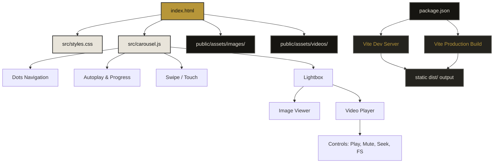

# Asfalto Livre · Poggers Skate Crew

**A rua é nossa escola. O skate é nossa língua.**

Projeto cultural de skate da **Poggers Skate Crew**,  Monte Belo, MG — desde 2022. O Asfalto Livre existe pra documentar, inspirar e fortalecer a cena do skate na cidade, usando o esporte como ferramenta de cultura e transformação.

---

## Sobre o projeto

A Poggers Skate Crew nasceu em 2022 em Monte Belo, MG. Começamos andando nos picos que a cidade tinha — a Estação Rodoviária, o Estacionamento da Prefeitura e a Quadrinha na Praça de Esportes. Com o tempo, a falta de estrutura local nos empurrou pra evoluir fora: passamos a frequentar cidades vizinhas como Muzambinho e Alfenas, onde rolam sessões na Emize Skate Park e na pista de skate local.

Sem obstáculos e sem espaço adequado, a solução foi construir com as próprias mãos. Com esforço próprio e doações, montamos obstáculos que usamos principalmente na Quadrinha. Hoje somos **16 membros** unidos pela mesma vibe.

### Missão

> Usar o skate como ferramenta de cultura e transformação em Monte Belo. Queremos visibilidade, investimento e espaço — pra que todo rolo da cidade tenha onde evoluir.

### Site

O site funciona como **vitrine do coletivo**: galeria de mídias, agenda de eventos, canais de contato e formas de apoiar o projeto. Cada mídia na galeria conta uma queda. Cada queda virou um trick.

---

## Funcionalidades

| Seção | Descrição |
|-------|-----------|
| **Hero** | Apresentação com identidade visual do projeto |
| **Sobre** | História do coletivo, vídeo em background, missão |
| **Galeria** | Carrossel com 24 mídias (fotos + vídeos), lightbox com player customizado |
| **Instagram** | Call-to-action para seguir @poggers_sk8 |
| **Eventos** | Agenda de encontros abertos ao público |
| **Apoie** | Chave PIX e link para Vakinha Online |
| **Contato** | Grupo de WhatsApp e perfil do Instagram |

### Galeria

24 slides em carrossel com navegação por botões, dots, swipe touch e progresso automático. Clique em qualquer mídia para abrir o lightbox:

- **Imagens**: dimensionamento automático (retrato/paisagem)
- **Vídeos**: player customizado com play/pause, mute, volume, seek bar, fullscreen e indicador de buffering

---

## Stack

| Camada | Tecnologia |
|--------|-----------|
| **Markup** | HTML5 semântico, ARIA |
| **Estilos** | CSS puro com custom properties, Flexbox, Grid |
| **Script** | JavaScript vanilla (ES modules) |
| **Build** | Vite |
| **Fontes** | Bebas Neue, DM Sans, Space Mono (Google Fonts) |
| **Ícones** | SVGs inline (sem bibliotecas externas) |

---

## Estrutura do projeto



---

## Como rodar localmente

```bash
# Instalar dependências
npm install

# Servidor de desenvolvimento (com HMR)
npm run dev

# Build de produção
npm run build

# Preview do build
npm run preview
```

O build de produção gera os arquivos otimizados na pasta `dist/`.

---

## Como apoiar

### PIX
Chave: `f85cb6cc-80df-41ae-b257-67eb56ffc182`  
Titular: Diego Antônio Bueno Vitor - PicPay

### Vakinha Online
Meta atual: R$ 1.500 — Quarter Pipe (rampa pro espaço comunitário)  
[Contribuir na Vakinha](https://www.vakinha.com.br/vaquinha/quarter-rampa-de-skate)

---

## Contato

- **Instagram**: [@poggers_sk8](https://instagram.com/poggers_sk8)
- **WhatsApp**: [Grupo da Poggers Skate Crew](https://chat.whatsapp.com/H1VoSoDyt007YdN5I4uRdE)

Encontros abertos todo **2º sábado do mês às 15h** na Quadrinha — Praça de Esportes, Monte Belo, MG.

---

## Licença

MIT © Poggers Skate Crew
